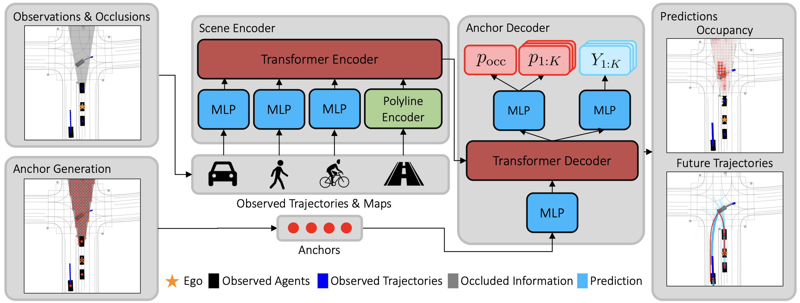
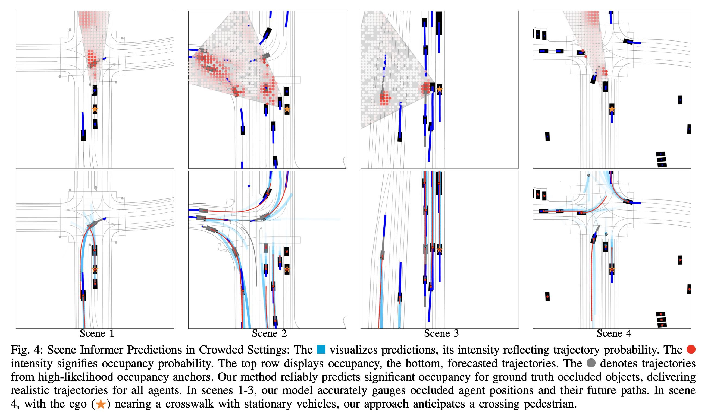

# Scene Informer: Anchor-based Occlusion Inference and Trajectory Prediction in Partially Observable Environments

This is the official implementation of the paper ["Scene Informer: Anchor-based Occlusion Inference and Trajectory Prediction in Partially Observable Environments"](https://arxiv.org/abs/2309.13893) by Bernard Lange, Jiachen Li, and Mykel J. Kochenderfer. Accepted to ICRA 2024.



## Abstract
Navigating complex and dynamic environments requires autonomous vehicles (AVs) to reason about both visible and occluded regions. This involves predicting the future motion of observed agents, inferring occluded ones, and modeling their interactions based on vectorized scene representations of the partially observable environment. However, prior work on occlusion inference and trajectory prediction have developed in isolation, with the former based on simplified rasterized methods and the latter assuming full environment observability. We introduce the Scene Informer, a unified approach for predicting both observed agent trajectories and inferring occlusions in a partially observable setting. It uses a transformer to aggregate various input modalities and facilitate selective queries on occlusions that might intersect with the AV's planned path. The framework estimates occupancy probabilities and likely trajectories for occlusions, as well as forecast motion for observed agents. We explore common observability assumptions in both domains and their performance impact. Our approach outperforms existing methods in both occupancy prediction and trajectory prediction in partially observable setting on the Waymo Open Motion Dataset.

## Visualizations


## Setup
See env.yml.

For dataset processing, we used waymo-open-dataset-tf-2-12-0==1.6.4.

Tested on Ubuntu 20.04 + Nvidia TITAN RTX 24 GB + AMD Ryzen Threadripper 3960X 24-Core

## Dataset Processing 
Download the Waymo Motion tfrecords dataset and update the paths in the script below. Processing the dataset takes time, so download a single sample from Waymo Motion v1.2.0 (training.tfrecord-00000-of-01000) and check the Jupyter notebook in the 'scripts' directory to see if the visualization meets expectations.
```
sh process_dataset.sh
```

Warning: This raw dataset contains various occlusions, most of which may not be of interest. If you are looking for specific scenarios or wish to reduce the number of samples, please update the generate_dataset_summary script to filter for samples of interest.

## Training
```
python scripts/train_lightning.py --base configs/scene_informer.yaml -t
```

## Citation
If you find our work useful in your research, please consider citing:
```
@article{Lange2023SceneInformer,
title={Scene Informer: Anchor-based Occlusion Inference and Trajectory Prediction in Partially Observable Environments},
author={Bernard Lange, Jiachen Li, and Mykel J. Kochenderfer},
journal={arXiv},
year={2023},
url={https://arxiv.org/abs/2309.13893}
}
```


