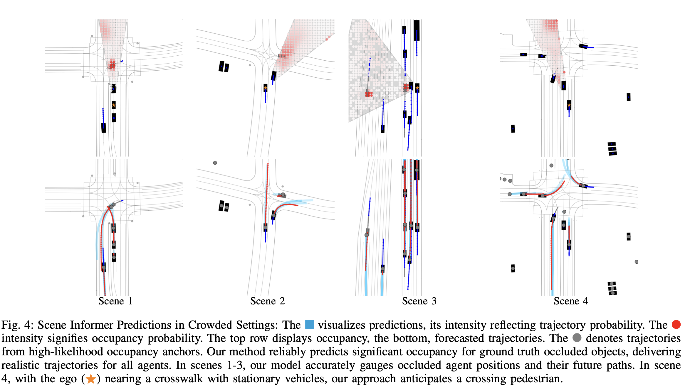

# Scene Informer: Anchor-based Occlusion Inference and Trajectory Prediction in Partially Observable Environments

This is the official implementation of the paper ["Scene Informer: Anchor-based Occlusion Inference and Trajectory Prediction in Partially Observable Environments"](https://arxiv.org/abs/2309.13893) by Bernard Lange, Jiachen Li, and Mykel J. Kochenderfer.


## Abstract
Navigating complex and dynamic environments requires autonomous vehicles (AVs) to reason about both visible and occluded regions. This involves predicting the future motion of observed agents, inferring occluded ones, and modeling their interactions based on vectorized scene representations of the partially observable environment. However, prior work on occlusion inference and trajectory prediction have developed in isolation, with the former based on simplified rasterized methods and the latter assuming full environment observability. We introduce the Scene Informer, a unified approach for predicting both observed agent trajectories and inferring occlusions in a partially observable setting. It uses a transformer to aggregate various input modalities and facilitate selective queries on occlusions that might intersect with the AV's planned path. The framework estimates occupancy probabilities and likely trajectories for occlusions, as well as forecast motion for observed agents. We explore common observability assumptions in both domains and their performance impact. Our approach outperforms existing methods in both occupancy prediction and trajectory prediction in partially observable setting on the Waymo Open Motion Dataset.

## Visualizations


## Setup
See env.yml

Tested on Ubuntu 20.04 + Nvidia TITAN RTX 24 GB + AMD Ryzen Threadripper 3960X 24-Core

## Training
```
python scripts/train_lightning.py --base configs/scene_informer.yaml
```
Dataset processing script will be shared soon.

## Citation
If you find our work useful in your research, please consider citing:
```
@article{Lange2023SceneInformer,
title={Scene Informer: Anchor-based Occlusion Inference and Trajectory Prediction in Partially Observable Environments},
author={Bernard Lange, Jiachen Li, and Mykel J. Kochenderfer},
journal={arXiv},
year={2023},
url={https://arxiv.org/abs/2309.13893}
}
```


